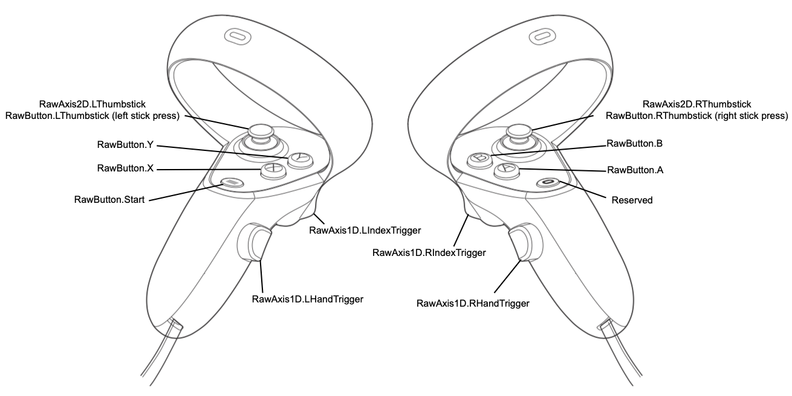
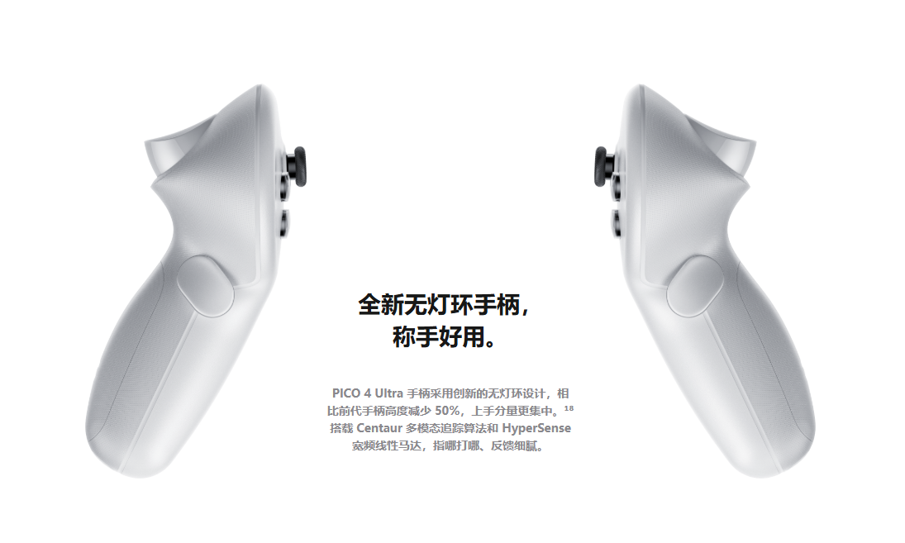
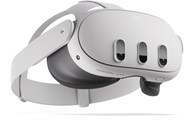
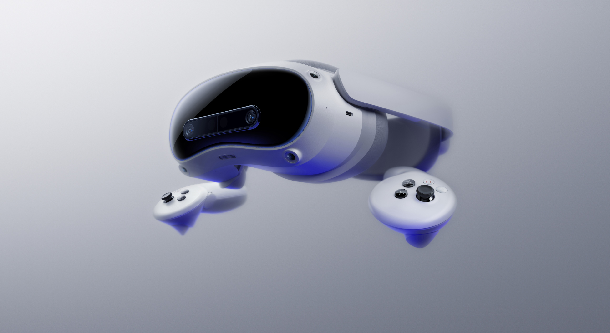
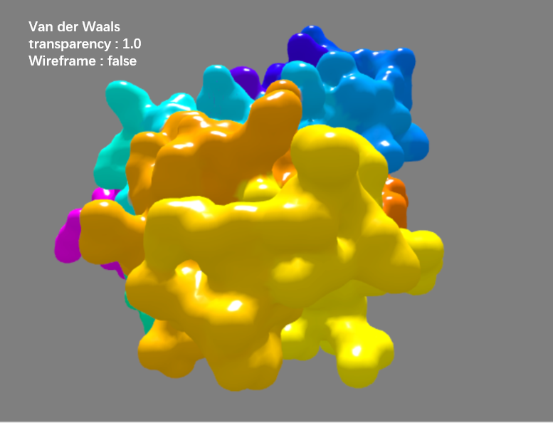
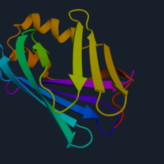
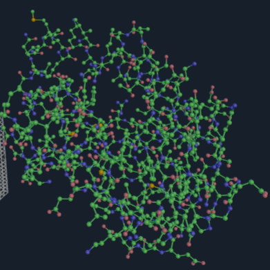
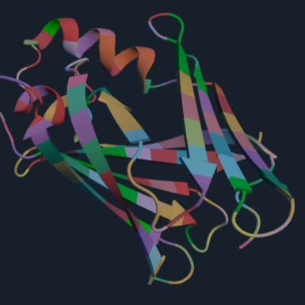
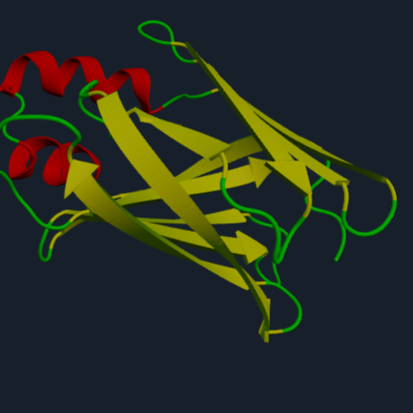

Contents
====

- [Overview](#Overview)
- [Quick Start](#quick-start)
    - [Installing ProVR](#installing-siga)
    - [Running ProVR](#Running-ProVR)
    - [Implement](#Implement)
- [Geting Start VR Mode](#Geting-Start-VR-Mode)
    - [Enter VR Scene](#Enter-VR-Scene)
    - [VR Menu](#VR-Menu)
    - [Loading PDB](#Loading-PDB)
    - [Drag PDB](#Drag-PDB)
    - [Design PDB](#Design-PDB)
    - [Surface](#Surface)
    - [Color](#color)
    - [Align](#align)
    - [Docking](#docking)
    - [Energy](#energy)
    - [RefineStructure](#refineStructure)

* [Citation](#citation)
* [FAQ](#faq)
* [Support](#support)
* [Authors](#authors)

Overview
========

ProVR 是一个基于 Three.js 开发的先进蛋白质设计工具，旨在为研究人员和生物学家提供沉浸式的虚拟现实体验。通过利用最新的 WebVR 技术，ProVR 提供了一个功能强大的平台，使用户能够在无限的虚拟环境中直观地设计和可视化蛋白质结构。

Quick Start
===========
## Requirements
环境安装
```
git clone https://github.com/DanFienne/ProVR.git
pip install "fastapi[standard]"

# login
pip install -r requirements.txt

# openmm
conda install -c conda-forge openmm
conda install -c conda-forge pdbfixer
conda install -c conda-forge pymol-open-source
```
## 1. 启动后端服务
### 方式一：使用脚本
```
./run.sh  [CONDA_ENV]  [HOST]  [PORT]
# 例
./run.sh  mol-env   0.0.0.0   9098
```
### 方式二：使用命令行
```
cd ProVR/server

uvicorn app:app \
    --reload \
    --host 0.0.0.0 \
    --port 9098 \
    --ssl-keyfile server.key \
    --ssl-certfile server.crt
```
## 2. 账号注册 / 登录
在浏览器中访问主页（默认端口 9098；以下以本地部署为例）
```
https://127.0.0.1:9098/
```

'若部署在其他主机或端口，将 127.0.0.1:9098 替换为实际的 HOST:PORT。
## 3. 上传 PDB 文件（桌面端）
登录后访问 Dashboard：
```
https://HOST:PORT/dashboard
```

在页面中选择并上传需要的 .pdb 文件。

上传完成后，这些文件即可在 VR 菜单「Load」列表中看到并加载。

## 4. VR 访问
戴上头显，在头显自带浏览器中直接访问：
```
https://HOST:PORT/vr
```
示例（本地部署）：
```
https://127.0.0.1:9098/vr
```

---

### 前置条件

* 已在服务器上运行 ProVR 服务
* VR 头显具备浏览器并可正常联网
* 服务器与 VR 头显网络可达（同局域网或公网可访问）

----

### 第一步：获取服务器 IP 地址（HOST）

根据你的系统选择对应方法，记录下“IPv4 地址”。

* Windows 11

    1. 打开命令提示符（Win+R 输入 cmd 回车）
    2. 输入：ipconfig
    3. 在当前联网的适配器下找到 IPv4 地址（示例：192.168.1.23）
* macOS / Linux

    1. 打开终端（Terminal）
    2. 输入：ifconfig 或 ip addr
    3. 找到当前网络接口（如 en0、wlan0）的 IPv4 地址（示例：192.168.1.23）

提示：

* 如果机器有多个网卡/适配器，请选择与 VR 头显在同一网络的那个接口的 IPv4。
* 若使用公网访问，请使用服务器的公网 IP 或已绑定的域名。

---

### 第二步：让 VR 头显访问 ProVR

你可以在`局域网模式`或`公网模式（联网模式）`下使用。

* 局域网模式（推荐低延迟）

    1. 确保 VR 头显与服务器在同一局域网（同一 Wi‑Fi/有线网络）
    2. 在 VR 头显的浏览器地址栏输入：
        * http://<服务器IPv4>:<服务端口>
        * 例：http://192.168.1.23:9098
    3. 如能访问首页，即表示连接成功
* 公网模式（远程访问）

    1. 确保服务器的公网地址可达，且已放行对应端口（云厂商安全组/本机防火墙）
    2. 在 VR 头显的浏览器地址栏输入服务器地址：
       * http://<域名或公网IP>:<服务端口>
       * 例：https://vr.example.com 或 http://203.0.113.10:9098
    3. 建议为公网启用 HTTPS，提升安全性与兼容性

---


### Implement

<table>
  <tr>
    <th style="text-align: left;">参数</th>
    <th style="text-align: left;">示例</th>
    <th style="text-align: left;">描述</th>
  </tr>
  <tr>
    <td style="text-align: left;">Tools</td>
    <td style="text-align: left;">"design","docking","energy","align"</td>
    <td style="text-align: left;">该参数表示工具所实现的特定功能或工作目标。例如，“design”蛋白质设计；“docking”对接工具；“energy”能量计算工具；“align”对齐工具。</td>
  </tr>
  <tr>
    <td style="text-align: left;">Name</td>
    <td style="text-align: left;">"ProDESIGN","HDock"</td>
    <td style="text-align: left;">该参数代表工具的具体名称，如“ProDESIGN”或“HDock”等。每个名称对应一个特定的工具，能够执行相应的功能。</td>
  </tr>
  <tr>
    <td style="text-align: left;">Address</td>
    <td style="text-align: left;">"https://0.0.0.0:9098/design"</td>
    <td style="text-align: left;">该参数表示工具对应的网络地址或访问路径，例如"https://0.0.0.0:9098/design" 。这个地址用于在网络环境中访问和使用相应的工具，确保用户能够通过浏览器或API接口进行操作。</td>
  </tr>
</table>

## Geting Start VR Mode

### 适用设备
本软件兼容以下主流VR设备型号

| Oculus Quest 3 / Oculus Quest 2                                     | Pico 4 / Pico 4 Ultra |
|:--------------------------------------------------------------------|-----------------------|
|  |      |
|    |           |

### Enter VR Scene

* 请使用支持 WebXR 的浏览器（例如：Google Chrome、Microsoft Edge、Firefox Reality 等）。
例如Google Chrome、Microsoft Edge、Firefox Reality等。


* 打开页面后，点击屏幕上的“ENTER VR”按钮进入 VR 模式。

参考示意图


注意：

若按钮不可点击，请确认：
* 浏览器版本已更新且已启用 WebXR。
* 设备/头显已连接并被系统识别。
* 页面已获得必要的传感器/设备权限。

### VR Menu

点按手柄x按钮，可打开/关闭 VR 菜单，实现VR的功能交互。
参考示意图：


### Loading PDB

点击`Menu`菜单中的`load`按钮，加载PDB。PDB文件需提前上传, PDB ID会在点击`load`
后，显示出来。选择目标PDB ID，加载PDB。

* 在菜单中点击「load」按钮。
* 先将 PDB 文件（或对应的 PDB ID 列表）预先上传至系统。
* 点击后会显示可用的 PDB ID；选择目标 PDB ID 即可开始加载。
* ProVR 支持加载蛋白质与 RNA。

设计模式说明：

* easy：简化的蛋白设计模式，适合快速预览与基础操作。

* hard：复杂的蛋白设计模式，提供更多约束与更真实的物理行为。

### Drag PDB

* 加载完成后，可在「Drag」面板中使用「zoom」按钮，快速将视角定位到分子周围的合适距离，便于观察与后续操作。

* 拖拽功能用于在 VR 场景中对结构进行交互式操作：
  * Drag Structure：拖拽整个分子结构（包括主链与配体），用于整体定位与快速放置。
  * Drag Chain：拖拽分子中的某一条链（例如抗体的 H 链或 L 链），适合处理多链复合物的相对位置。
  * Drag Residue：拖拽单个残基（或局部位点）。完成拖拽后，系统将调用 OpenMM 进行分子动力学约束与能量最小化，以缓解不合理的几何或碰撞。

操作建议与注意事项：

* 拖拽时建议配合「zoom」先调整视角，避免误选。
* 对于大型蛋白质体系，OpenMM 计算可能需要更长时间；请在计算完成前避免频繁重复拖拽。
* 若出现锚点选择不准确，可放大并切换选择模式（结构/链/残基）后再尝试。
### Surface

`Surface`可以展示蛋白质的表面，使用的是范德华力表面。通过调整透明度0.2-1.0来显示不同的效果，有0.2、0.4、0.6、0.8、1.0



### Color

* 在 VR Menu 的 Color 面板中，可按以下维度着色：
  * Element（元素）
  * Residue（残基）
  * SecStructure（二级结构）
  * Chain（链）
  * PDB（整蛋白/分子级别）
  * Hydrophobicity（疏水性）

| `蛋白质（PDB）`                                                            | `元素（Element）`                                                             | `残基（Residue）`                                                             | `二级结构（SecStructure）`                                                 |
|:----------------------------------------------------------------------|:--------------------------------------------------------------------------|:--------------------------------------------------------------------------|:---------------------------------------------------------------------|
| 使用`Spectrum`从冷色调到暖色调的颜色渐变。                                            | 使用`Spectrum`从冷色调到暖色调的颜色渐变。                                                | 使用`Spectrum`从冷色调到暖色调的颜色渐变。                                                | 使用`Spectrum`从冷色调到暖色调的颜色渐变。                                           |
|  |  |  |  | 

* 元素着色常用于快速识别 C/H/O/N/S 等原子分布。
* 二级结构着色有助于区分 α-螺旋、β-折叠与无规卷曲。
* 链着色适合多链复合物的界面识别。
* 疏水性着色可辅助识别潜在结合位点或疏水核心。
### Align

* 功能概述：对两条蛋白质链进行序列比对与结构对齐，以识别结构相似性与差异。
* 工作流程：

  1. 基于序列比对确定最佳匹配区段。
  2. 依据匹配结果执行三维结构对齐（空间叠合）。
* 适用场景：
  1. 同源蛋白的结构差异分析与保守区域定位。
  2. 结构-功能关系的比对与可视化。
* 使用建议：
  1. 先限定对比链（减少冗余），再执行对齐。
  2. 对插入/缺失区域可单独隐藏或着色以突出差异。
  3. 对齐后可结合 Residue/SecStructure 着色强化对比效果。
### Docking

`Docking` 功能是实现两个蛋白质对接的功能。

可以加入自定义的插件，添加新的docking软件接口。传递的参数为 `接口地址、docking软件名称、配体PDB、受体PDB` 即可加载到ProVR中使用。

使用时，先选择对应的docking工具名，然后分别选择配体和受体，即可实现docking功能。docking完成后，会在ProVR中展示docking结果。

### 投影

### Pico 4 Ultra
在VR设备中，选择投屏按钮，根据提示，即可投屏（推荐）

### Oculus Quest
要将 Oculus Quest 的画面投屏到电脑上，可以通过 ADB 工具和 scrcpy 实现。以下是详细步骤：

###  1.准备工作
确保 Oculus Quest 设备和电脑连接在同一个 Wi-Fi 网络下。

确保 Oculus Quest 已开启「开发者模式」和「USB 调试」功能。

### 安装必要工具：

在电脑上安装 ADB（Android Debug Bridge），或使用更友好的图形化工具 SideQuest。

下载并安装 scrcpy（一个开源的 Android 屏幕镜像工具）。

### 连接设备

使用 USB 数据线将 Oculus Quest 连接至电脑。

打开终端（命令提示符或 PowerShell），输入以下命令确认设备已连接：
```
adb devices
```
若设备已连接，将显示设备序列号。

启用无线调试

输入以下命令，切换到无线调试模式（默认端口为 5555）：
```
adb tcpip 5555
```
断开 USB 连接，并获取 Oculus Quest 的 IP 地址（可在设备设置 > 关于 > 网络中查看）。

使用以下命令连接设备（将 VR头盔IP 替换为实际 IP 地址）：
```
adb connect ‘VR头盔IP’:5555
```
启动投屏

在终端中运行以下命令，启动 scrcpy 并进行投屏：
```
scrcpy -m 1024 --bit-rate 2M --max-fps 30 --no-control
```
参数说明：

-m 1024：限制分辨率为 1024 像素，减小延迟

--bit-rate 2M：设置视频码率为 2 Mbps

--max-fps 30：限制最大帧率为 30 FPS

--no-control：仅投屏，不控制设备


Citation
========

```
@article{10.1093/bioinformatics/btaa696,
    author = {Xu, Kui and Liu, Nan and Xu, Jingle and Guo, Chunlong and Zhao, Lingyun and Wang, Hong-Wei and Zhang, Qiangfeng Cliff},
    title = "{VRmol: an Integrative Web-Based Virtual Reality System to Explore Macromolecular Structure}",
    journal = {Bioinformatics},
    year = {2020},
    month = {08},
    issn = {1367-4803},
    doi = {10.1093/bioinformatics/btaa696},
    url = {https://doi.org/10.1093/bioinformatics/btaa696},
    note = {btaa696},
    eprint = {https://academic.oup.com/bioinformatics/advance-article-pdf/doi/10.1093/bioinformatics/btaa696/33560033/btaa696.pdf},
}
```

FAQ
====

Support
=======

Authors
=======
